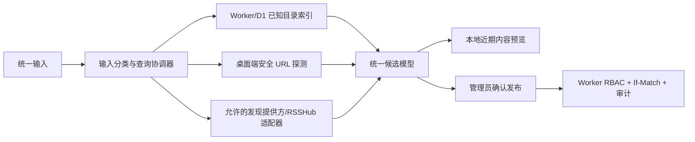

# 插入式计划：统一发现与原生控件视觉体系

状态：进行中；DISC-01～DISC-04、UX-03 已完成，下一项 DISC-05
插入位置：P2-02 之后、P2-03 之前
最后核对：2026-07-28
产品参考：RSSNext/Folo 的统一发现交互；实现边界仍以 [RSS 总路线图](RSS_MASTER_ROADMAP.md) 为准

## 1. 目标与范围

本计划先补齐“找到订阅源并安全加入共享目录”的入口，再修复资讯页暴露出的原生控件视觉割裂。完成后：

- 管理员可以在一个输入框中输入关键词、站点/Feed URL 或受支持的 RSSHub 路由，查看可验证的订阅源和近期内容预览，再加入共享目录。
- 普通用户不获得共享目录写权限；首版统一发现入口放在管理员订阅管理中，所有发布仍由 Worker/D1 RBAC、版本并发和审计保护。
- 时间线/图片切换、日期选择、复选框和下拉框使用统一的 WPF 视觉语言，同时保留键盘、焦点、缩放和辅助功能语义。
- 本计划不把桌面端迁移到 Electron、Tauri 或 WebView2。截图中的根因是部分 WPF 控件仍使用默认模板，而不是 WPF 无法实现该视觉。

Folo 仅作为公开可观察的产品行为参考。本项目不复制其 AGPL 源码、React 组件、样式、图标、客户端 SDK，不调用 `api.folo.is`，也不假设其未开源服务端可复用。

## 2. 产品行为

### 2.1 统一输入

输入按确定顺序分类，分类结果在发起网络请求前可测试：

1. `http://` 或 `https://`：作为站点或 Feed URL 安全探测。
2. `rsshub://`：作为显式 RSSHub 路由；只允许已配置且通过条款审查的适配器解析。
3. 其他非空文本：作为关键词搜索。
4. 空白、超长文本、控制字符或不支持的协议：本地拒绝，不进入网络层。

输入分类只决定候选解析器，不等于信任 URL。所有远程探测继续复用现有固定地址、重定向、响应大小、超时和 SSRF 防护。

### 2.2 发现结果

每个候选卡片至少显示：

- 标题、规范化 Feed URL、站点 URL、来源提供方和匹配原因。
- 可验证的 Feed 类型、最近更新时间、健康/警告状态。
- 最多 4 条近期内容预览；预览由桌面端安全抓取并仅落本地缓存。
- “预览”和“加入共享目录”操作；已经存在的 Feed 显示当前状态，不重复添加。

首版不显示无法可靠获得的“订阅人数”，也不伪造 Folo 的社交热度。排序依据必须可解释：精确 URL/标题命中优先，其次是健康度、新鲜度和提供方置信度。

### 2.3 失败和降级

- 单个提供方超时、限流或格式变化不得阻塞其他结果。
- 关键词服务不可用时，仍允许直接 URL 探测、已有共享目录搜索和 OPML 导入。
- RSSHub 或平台适配器可单独禁用，并显示可操作的原因，不把内部异常直接暴露给用户。
- 搜索结果不能直接写入目录；管理员确认后才走现有发布链路。

## 3. 架构边界

- Worker/D1 只保存发现所需的 Feed 元数据、规范化地址、提供方、更新时间和健康摘要；不保存文章正文、AI 结果、字幕或本地路径。
- 现有 `managed_feeds` 是首个可信索引来源，但它只能覆盖已知目录。关键词全网发现必须通过独立的提供方接口扩展，不能假装现有 `IFeedDiscoveryService` 已具备搜索全网的能力。
- 提供方接口返回来源、置信度和警告，便于排名、故障隔离和后续替换；任何外部服务接入前必须核对官方 API、速率限制、许可和隐私条款。
- 最近内容预览保留在桌面端，沿用现有解析、净化、图片安全下载和本地缓存边界。
- 添加订阅复用现有带 `If-Match` 的目录发布、幂等键、冲突刷新和审计，不新增绕过版本控制的写端点。

## 4. 原生控件视觉决策

本轮保留 .NET/WPF。先建立共享控件模板，再决定是否需要更高成本的 UI 技术迁移：

- `TabControl/TabItem`：实现分段切换样式，覆盖普通、悬停、选中、聚焦、禁用状态，替换“时间线/图片”的系统默认页签。
- `DatePicker/Calendar`：统一圆角、边框、图标、弹层、文本和错误状态，不依赖系统默认按钮外观。
- `CheckBox`：统一勾选框尺寸、选中/不确定/聚焦/禁用状态，并扩大可点击区域。
- `ComboBox`：收敛到现有 `CompactComboBoxStyle`，补齐焦点、弹层、禁用和高 DPI 细节。

不得为了视觉效果把语义控件改成无键盘行为的 `Border + TextBlock`。必须保留 Tab 导航、方向键、Space/Enter、日历弹层、焦点可见性和 UI Automation 名称。

## 5. 可执行任务

### DISC-01：统一发现契约与输入分类

**目标：** 建立不依赖 UI 和外部提供方的查询、候选、来源、健康和警告契约。

**依赖：** P0 安全 Feed 探测与目录模型。

**主要文件：** Core 新增 discovery 模型/分类器、对应 Core 测试。

**验收：**

- [x] URL、RSSHub 路由、关键词和非法输入有确定分类。
- [x] 候选项携带规范化标识、来源、置信度、健康和警告，不用显示文本驱动业务逻辑。
- [x] 合并去重以规范化 Feed URL 为主键，来源证据可保留。

**验证：** 2026-07-27 已通过 24 项 Core 定向测试，覆盖 Unicode 关键词、主机大小写与默认端口规范化、路径大小写/尾斜杠语义、重定向后地址、危险协议、凭据/片段和超长输入；候选合并保留类型化来源证据并拒绝不安全标识。

### DISC-02：已知目录索引与发现查询 API

**目标：** 让 Worker/D1 对已知 Feed 元数据提供可分页、可缓存、只读的关键词查询。

**依赖：** DISC-01；现有目录版本和公开读取端点。

**主要文件：** Worker migration、discovery route/repository、workerd/D1 集成测试。

**验收：**

- [x] 索引只包含允许上云的 Feed 元数据，不含条目正文或私人状态。
- [x] 查询有长度、分页和速率限制；排名稳定并返回来源证据。
- [x] 普通用户可按产品策略读取结果但不能写目录，管理员写入仍走原目录端点。
- [x] 旧数据库可原位迁移并由现有 `managed_feeds` 安全回填。

**验证：** 2026-07-28 已新增 `0008_feed_discovery_index.sql` 与认证后的 `GET /v1/feeds/discoveries`。真实 workerd/D1 定向测试 17/17 通过，覆盖带旧目录数据原位回填、Feed/分类触发器同步、软删除、确定性排名与跨页游标、精确 URL/站点证据、ETag/304、空结果、ACTIVE/ALL RBAC、未知/重复/超长参数、游标绑定、每用户 60 次/分钟限流、发现路径拒绝写入，以及响应和索引敏感字段不存在。全量门禁为 Worker 63/63、strict typecheck、npm audit 0 漏洞、.NET Release 706/706 且构建 0 警告。

### DISC-03：安全解析器与可替换提供方

**目标：** 聚合已知目录、直接 URL 探测和获批的外部发现适配器，且任一来源失败可降级。

**依赖：** DISC-01～DISC-02。

**主要文件：** Infrastructure 协调器/适配器、DI 注册、Infrastructure 测试。

**验收：**

- [x] 直接 URL 复用现有 SSRF、固定地址、重定向、大小和超时限制。
- [x] 提供方具备独立超时、并发上限、缓存、熔断和脱敏错误。
- [x] RSSHub/平台适配器只有在官方条款与稳定接口核对完成后才启用。
- [x] 一个提供方失败时仍返回其他候选，并明确部分结果状态。

**验证：** 2026-07-28 已交付 `IUnifiedFeedDiscoveryService`、可替换 `IFeedDiscoveryProvider`、Worker 已知目录 provider、复用原安全探测器的 direct provider，以及每来源独立的超时、并发门闩、成功缓存和熔断状态。47 项发现链路定向测试覆盖超时、429、畸形/空目录项、重复候选、来源证据伪造、provider 集合快照、取消、私网/回环/混合 DNS/重绑定、固定 IP、部分成功与全部来源不可用；默认 DI 只注册 direct 与 Worker 已知目录，未注册 RSSHub 或外部平台适配器。完整检查点为 .NET Release 722/722、Worker 63/63、strict typecheck、npm audit 0 漏洞和构建 0 警告/0 错误。

### UX-03：共享 WPF 控件模板

**目标：** 修复截图中默认 Tab、DatePicker、CheckBox 与现有界面不一致的问题，为发现页提供可复用视觉基础。

**依赖：** 现有主题资源和 `CompactComboBoxStyle`。

**主要文件：** `Themes/Controls.xaml`、`Themes/DateControls.xaml`、`FeedTimelineView.xaml`、`FeedTimelineFiltersView.xaml`、`FeedPictureView.xaml`、`FeedTimelineBrowserView.xaml` 及 App 结构/运行时测试。

**验收：**

- [x] 时间线/图片使用分段页签；日期、复选框和下拉框使用统一样式。
- [x] 普通、悬停、按下、选中、聚焦、禁用和校验错误状态完整。
- [x] 100%～200% DPI、窄窗口、浅色/深色主题下无裁切、错位或低对比。
- [x] 键盘、屏幕阅读器语义、日历弹层和现有绑定行为不回退。

**验证：** 2026-07-28 已先以 3 项结构测试冻结共享样式、模板部件、完整交互状态、资讯页接线和 UI Automation 名称，再交付分段页签、复选框、增强下拉框及独立日期/日历资源字典。真实 WPF 运行时测试覆盖方向键切换、原生 Automation Peer、日历弹层选择回写、日期水印/文本、900×620 窄窗、等效 200% 布局缩放和运行中深浅主题切换；浅色/深色 Release 离屏渲染经人工检查无裁切、错位或低对比。完整门禁为 .NET Release 726/726（App/WPF 209/209）、Worker 63/63、strict typecheck、NuGet/npm 0 漏洞和构建 0 警告/0 错误。历史、管理和设置页的同类控件保留为后续独立迁移片，避免扩大本任务范围。

### DISC-04：管理员统一发现页面

**目标：** 用 UX-03 组件交付统一输入、搜索状态、候选卡片、近期预览和空/错状态。

**依赖：** DISC-01～DISC-03、UX-03。

**主要文件：** discovery View/ViewModel、导航/DI、App 测试。

**验收：**

- [x] 输入会显示识别类型，支持提交、取消和防抖，不因旧请求覆盖新结果。
- [x] 候选卡片显示来源、健康、警告和最多 4 条真实近期预览。
- [x] 加载、部分成功、无结果、离线和限流状态可区分且可重试。
- [x] 普通用户不显示或不可进入管理写入口；绕过 UI 仍无法发布。

**验证：** ViewModel 单测、WPF 运行时测试和 Release 应用键盘/缩放/断网检查。

**完成记录（2026-07-28）：** 管理员订阅管理新增独立“发现”页签，接通统一协调器并保留现有 Feed 编辑器的 URL 安全保存门禁。输入即时分类，450 ms 防抖与显式提交共用请求代次；输入变化、取消或会话降权会立即终止当前请求，即使 provider 忽略取消也不能覆盖新结果，手动取消也会及时释放命令状态。候选卡显示来源、健康、风险、文档类型和更新时间；本地近期预览以一次有界 SQLite 窗口查询为所有匹配 Feed 只投影标题/时间，过滤隐藏条目且每 Feed 最多 4 条，不物化正文。加载、部分成功（含零候选）、空结果、离线、限流、非法输入和取消均有独立状态；页面无发布命令且沿用订阅管理的管理员导航隔离。聚焦 App 27/27 与真实 SQLite 1/1 通过；完整 Release 为 Core 140/140、Infrastructure 378/378、App/WPF 220/220、Worker 63/63、strict typecheck 和构建 0 警告/0 错误。

### DISC-05：预览与管理员发布闭环

**目标：** 从候选安全预览并加入共享目录，不产生重复、越权或并发覆盖。

**依赖：** DISC-04；P0 目录发布链路。

**主要文件：** 发现页发布命令、现有目录客户端接线、App/Infrastructure 测试。

**验收：**

- [ ] 发布前显示规范化地址、分类、刷新和视图策略，管理员必须确认。
- [ ] 重复 Feed 转为“查看现有项”；并发冲突刷新目录且不自动重放写入。
- [ ] 使用现有 `If-Match`、幂等键、RBAC 和审计；普通用户写入得到 403。
- [ ] 发布成功后目录版本刷新，发现结果状态同步更新。

**验证：** 覆盖重复提交、双管理员冲突、令牌过期、普通用户、网络中断和成功后刷新。

### DISC-06：检查点与文档

**目标：** 在恢复 P2-03 前关闭功能、安全、性能、可访问性和文档证据。

**依赖：** DISC-01～DISC-05、UX-03。

**验收：**

- [ ] .NET Release 构建/测试和 Worker strict typecheck/test 全部通过。
- [ ] 关键词首批结果、直接 URL 探测和候选预览在约定预算内；慢源不拖垮整体。
- [ ] D1 无正文/私人状态，日志无完整令牌、敏感查询参数或本地路径。
- [ ] 普通用户写入 403、管理员并发冲突、离线降级和恶意 URL 有真实证据。
- [ ] 用户指南、项目指南、威胁模型和测试报告同步。

**验证：** 真实 SQLite + workerd/D1 + Release WPF 联合检查；完成后把本计划状态改为已完成，再从 P2-03 继续。

## 6. 执行顺序与提交边界

1. DISC-01：先冻结契约和输入安全边界。
2. DISC-02：交付可用的已知目录关键词搜索。
3. DISC-03：接入直接 URL 和经批准的可替换提供方。
4. UX-03：建立控件模板并先修复资讯页。
5. DISC-04：基于统一控件交付发现页面。
6. DISC-05：接通管理员发布闭环。
7. DISC-06：全量检查点与文档同步。
8. 恢复 `RSS_P2_VIEWS_INTEGRATIONS.md` 的 P2-03。

DISC-01～DISC-03 后执行一次契约/安全检查点；UX-03～DISC-05 后执行一次桌面运行时检查点。每个编号独立提交，不把整个计划压成一次大提交。

## 7. 风险与退出条件

| 风险 | 根因 | 控制 |
|---|---|---|
| 把 Folo UI 当成可直接复用实现 | 客户端公开不等于后端/API 可自托管 | 清洁室实现，独立契约，不调用 Folo API/SDK |
| 关键词结果少或排名差 | 现有目录不是全网索引 | 显示来源和匹配原因，允许逐个增加合规提供方 |
| 平台/RSSHub 路由失效 | 第三方规则、条款和限流会变化 | 适配器隔离、可禁用、缓存和健康状态 |
| 发现入口扩大 SSRF 面 | 用户输入可触发远程探测 | 复用固定地址策略、逐跳验证、大小/超时/并发限制 |
| 为美化控件整体迁移 Web | 把局部模板缺失误判为技术栈缺陷 | 先交付 UX-03 并用真实 Release 结果再评估 |

若 UX-03 完成后仍有经过测量的关键能力无法由 WPF 满足，再单独编写技术栈迁移 ADR，量化原生窗口、SQLite、媒体管线、测试、安装更新和无障碍回归成本；本计划不预先承诺重构。
