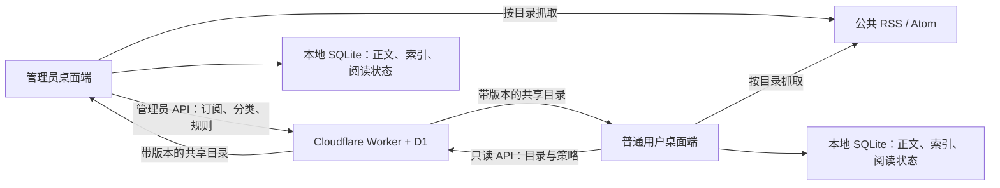

# 管理员策展 RSS 集成总路线图

状态：Gate 0、P0、P1、P2-01～P2-13、DISC-01～DISC-06 与 UX-03 已完成；P2-14 及以后仍需明确选择
最后核对：2026-08-03
参考基线：[RSSNext/Folo](https://github.com/RSSNext/Folo) `dev` 分支提交 [`773f1bfe`](https://github.com/RSSNext/Folo/commit/773f1bfe218ac349b9fb9b5cbd982c320f6b414f)

## 1. 目标与验收边界

Lenx Tools 将从“固定早报 + 固定热点源”扩展为“管理员策展、本地优先、普通用户只读共享订阅配置的智能资讯中心”。

“普通用户只观看”在本路线中定义为：

- 普通用户不能新增、编辑、删除、启停、排序 RSS，也不能导入 OPML、修改抓取策略、分类、自动化规则或外部集成配置。
- 普通用户可以浏览、搜索、筛选、阅读和播放管理员发布的内容。
- 默认允许普通用户在本机保存已读、收藏、阅读进度和私人备注；这些状态不改变共享订阅目录。如产品要求绝对零写入，可在实现时增加“纯展示模式”策略。
- 管理员权限必须由 Worker/D1 服务端逐端点校验；隐藏按钮或客户端 `IsAdmin` 只能改善界面，不能作为授权控制。

最终验收不是“出现添加订阅按钮”，而是管理员可安全发布订阅目录，普通用户只能同步并消费该目录，断网仍可阅读缓存，任一坏源不会拖垮其他来源。

## 2. 关键架构决策

采用“云端权威目录 + 客户端本地抓取和缓存”的混合模式：

理由：

- 复用现有 Worker 的账号、角色、令牌、审计基础，实现真正的服务端管理员授权。
- 保持当前规格“云端不保存新闻正文、字幕和本地文件”的隐私边界。
- 复用现有 SQLite、FTS5、原生 WPF 阅读器和离线缓存能力。
- 避免依赖 Folo 未开源的服务端和 `api.folo.is`。

已知代价：不同客户端抓取时间可能不同，会重复请求来源站点，管理员看到的健康状态默认是本机视角。若未来要求所有用户看到完全一致的文章集合、共享 AI 结果或服务端邮件摘要，必须先单独批准“服务端聚合并保存资讯内容”的规格、成本和隐私变更，不能在 P0 中隐式扩权。

正式决策见 [ADR-001](../decisions/ADR-001-admin-curated-rss.md)。

## 3. 计划文档与执行顺序

| 顺序 | 文档 | 交付结果 | 状态 |
|---:|---|---|---|
| 0 | [现有未完成项对齐计划](EXISTING_BACKLOG_ALIGNMENT.md) | 收口字幕里程碑，明确旧欠账并入哪个阶段 | 已完成 |
| 1 | [P0：管理员订阅与只读目录](RSS_P0_ADMIN_CATALOG.md) | 管理员可管订阅，普通用户可同步、抓取、阅读 | 已完成 |
| 2 | [P1：阅读增强、AI 与自动化](RSS_P1_READING_INTELLIGENCE.md) | 收藏/标签/备注、全文、图片缓存、AI、规则、媒体衔接 | 已完成 |
| 3 | [统一发现与原生控件视觉体系](RSS_DISCOVERY_AND_CONTROL_UX.md) | Folo 风格统一发现的清洁室实现；修复资讯页默认 WPF 控件视觉 | 已完成 |
| 4 | [P2：内容视图、导出与定时摘要](RSS_P2_VIEWS_INTEGRATIONS.md) | 多内容视图、外部导出、Windows 通知和摘要 | 进行中；P2-01～P2-13 已完成，P2-14 及以后待逐项选择 |

执行原则：

1. 先完成当前已进入半成品状态的字幕闭环，避免同时留下两套跨层未完成链路。
2. 每次只实现一个可运行的垂直切片；数据库迁移、接口契约和共享模型变更必须串行。
3. 每 2～3 个任务执行一次构建、测试和手动检查点。
4. P0/P1/P2 不是三个大提交；各专项计划中的任务才是实现和提交单位。
5. 未满足完整验收条件前，不在总清单中勾选完成。
6. 统一发现与原生控件视觉插入计划已经关闭，P2-01～P2-13 已验收；P2-14 及后续适配器只在明确选定后按独立垂直切片推进。

## 4. 数据所有权与领域模型

### 4.1 Worker/D1 权威数据

- `feed_categories`：共享分类、排序、启用状态。
- `managed_feeds`：Feed URL、站点 URL、显示名、分类、视图类型、全文/刷新/排序/启用策略和 AI 策略覆盖。
- `feed_catalog_state`：共享目录的单调版本与最后变更。
- `automation_rule_state`、`automation_rules`、`automation_rule_versions`：规则集版本、当前规则快照和不可变历史版本。
- 现有 `users`、`refresh_tokens`、`audit_events`：身份、角色和管理员操作审计。

D1 不在本路线默认保存文章正文、AI 结果、字幕、用户文件名或本地路径。

### 4.2 本地 SQLite 数据

- `feed_catalog`、`feed_categories`：服务端目录镜像，带版本和最后同步时间。
- `feed_fetch_state`：ETag、Last-Modified、下次抓取、成功/失败时间、连续失败次数和脱敏错误码。
- `feed_entries`：Feed 内稳定 ID、规范化 URL、标题、作者、时间、摘要、净化正文、附件元数据和内容哈希。
- `user_entry_states`：已读、收藏、阅读进度、私人备注。
- `entry_assets`：图片/封面等离线资源索引。
- `feed_full_text_content`、`feed_full_text_jobs`、`feed_full_text_host_state`：全文缓存、任务租约和主机退避。
- `feed_ai_automation_jobs`、`feed_ai_automation_daily_entries`：AI 自动任务和每日不同条目计数。
- `feed_automation_rule_state`、`feed_automation_rules`、`feed_automation_runs`、`feed_automation_action_runs`：ACTIVE 规则镜像、确定性计划、动作租约和执行账本。
- `feed_media_deliveries`、`app_notifications`：Feed 媒体投递来源和应用内通知收件箱。

不得直接把通用 Feed 塞进现有 `news_articles`：当前模型没有 Feed、分类、附件和阅读状态；`content_hash UNIQUE` 也会错误合并不同来源的转载。旧早报数据必须向后兼容读取或显式迁移，不能靠迁移失败后重建数据库。

## 5. 功能范围

### P0：可用且可管

- 客户端登录、刷新令牌、角色和会话状态接线。
- 管理员 RSS/Atom 新增、编辑、删除、启停、分类、排序和刷新策略。
- 普通用户只读目录同步；管理员端点服务端 RBAC 和审计。
- OPML 预览、选择性导入和导出，仅管理员可操作。
- 安全 Feed 探测、RSS/Atom 解析、条件请求、退避、去重和失败隔离。
- 时间线、来源/分类筛选、虚拟化、离线回退和 Feed 健康状态。
- 将首页演示数据替换为真实资讯、热点和任务数据。

### P1：读得好、处理得动

- 已读、收藏、标签、私人备注和阅读进度。
- 全文提取、净化阅读、封面/正文图片离线缓存和保留策略。
- AI 摘要、翻译、共享的管理员策略与本地结果缓存。
- 管理员自动化规则：关键词标记、过滤、自动翻译/摘要、媒体转写、通知。
- 音频/视频附件进入现有媒体工作台；字幕结果和模型用量进入历史。
- 统一搜索覆盖 Feed、热点、AI、字幕、标签和收藏。

### P2：多形态和生态连接

- 文章、图片、音频、视频、通知等内容视图和智能视图。
- Markdown、Obsidian、Eagle 与 Zotero 已按统一导出接口完成；Readwise/Cubox/Readeck/Outline/qBittorrent 等后续适配器仍需逐个选择和交付。
- 受控自定义 Webhook、目标健康检查、失败重试和审计。
- 本地每日/每周摘要、定时 AI 任务、勿扰策略和 Windows 系统通知；P1 已完成的应用内通知收件箱继续复用。
- 服务端邮件摘要只作为独立隐私决策后的可选扩展，不混入默认路线。

### 插入优先项：统一发现与控件视觉

- 管理员使用统一输入搜索关键词、直接 URL 或经批准的 RSSHub 路由，预览真实候选后加入共享目录。
- Worker/D1 只索引 Feed 元数据；近期条目预览仍由桌面端安全抓取并留在本地。
- 搜索提供方可替换、可降级，不依赖 Folo 私有服务；首版不伪造订阅人数或社交热度。
- 建立 WPF `TabControl`、`DatePicker`、`CheckBox` 和 `ComboBox` 共享模板，先修复资讯页，再审计其他页面。
- 本轮不迁移 Electron/WebView；若共享模板完成后仍存在经测量的技术栈缺口，再单独编写迁移 ADR。

明确不做：Folo 社区/公开个人主页、钱包/打赏/支付、完整 AI Chat、移动端、依赖 Folo API、复制 Folo React/Electron 代码或图标。

## 6. 参考项目与功能溯源

Folo 只作为产品行为和数据流参考；Lenx Tools 使用 C#/.NET/WPF 独立实现。

| 能力 | 主要参考 | Lenx Tools 复用点 | 采用方式 |
|---|---|---|---|
| 统一发现与订阅入口 | Folo [`UnifiedDiscoverForm.tsx`](https://github.com/RSSNext/Folo/blob/773f1bfe218ac349b9fb9b5cbd982c320f6b414f/apps/desktop/layer/renderer/src/modules/discover/UnifiedDiscoverForm.tsx) | 新建管理员管理页 | 参考交互，不复制代码 |
| OPML 预览/导入 | Folo [`DiscoverImport.tsx`](https://github.com/RSSNext/Folo/blob/773f1bfe218ac349b9fb9b5cbd982c320f6b414f/apps/desktop/layer/renderer/src/modules/discover/DiscoverImport.tsx)、[`OpmlSelectionModal.tsx`](https://github.com/RSSNext/Folo/blob/773f1bfe218ac349b9fb9b5cbd982c320f6b414f/apps/desktop/layer/renderer/src/modules/discover/OpmlSelectionModal.tsx) | WPF 预览对话框、Worker 批量写入 | 清洁室重写 |
| 订阅/缓存状态流 | Folo [`subscription/store.ts`](https://github.com/RSSNext/Folo/blob/773f1bfe218ac349b9fb9b5cbd982c320f6b414f/packages/internal/store/src/modules/subscription/store.ts)、[数据库 schemas](https://github.com/RSSNext/Folo/blob/773f1bfe218ac349b9fb9b5cbd982c320f6b414f/packages/internal/database/src/schemas/index.ts) | `NewsCenterService`、SQLite、FTS5 | 采用数据流思想，重新建模 |
| 内容视图 | Folo [`tabs.tsx`](https://github.com/RSSNext/Folo/blob/773f1bfe218ac349b9fb9b5cbd982c320f6b414f/packages/internal/constants/src/tabs.tsx) | WPF 时间线和多媒体视图 | 只采用适合桌面的视图类型 |
| 自动化规则 | Folo [`action/constant.ts`](https://github.com/RSSNext/Folo/blob/773f1bfe218ac349b9fb9b5cbd982c320f6b414f/packages/internal/store/src/modules/action/constant.ts)、[`action/store.ts`](https://github.com/RSSNext/Folo/blob/773f1bfe218ac349b9fb9b5cbd982c320f6b414f/packages/internal/store/src/modules/action/store.ts) | 新建规则模型、解释器和运行记录 | 重新定义受限字段/动作 |
| AI 摘要/翻译 | Folo [`summary/store.ts`](https://github.com/RSSNext/Folo/blob/773f1bfe218ac349b9fb9b5cbd982c320f6b414f/packages/internal/store/src/modules/summary/store.ts)、[`translation/store.ts`](https://github.com/RSSNext/Folo/blob/773f1bfe218ac349b9fb9b5cbd982c320f6b414f/packages/internal/store/src/modules/translation/store.ts) | 现有 `DeepSeekReportService`、`ai_reports` | 复用现有 AI 安全边界 |
| 全文阅读 | Folo [`packages/readability`](https://github.com/RSSNext/Folo/tree/773f1bfe218ac349b9fb9b5cbd982c320f6b414f/packages/readability) | `RichArticleFormatter`、图片下载器 | 评估 .NET 实现，不复制包 |
| 媒体转写 | Folo [`useTranscription.ts`](https://github.com/RSSNext/Folo/blob/773f1bfe218ac349b9fb9b5cbd982c320f6b414f/apps/desktop/layer/renderer/src/modules/entry-content/components/layouts/shared/useTranscription.ts) | 现有 Groq/本地 Whisper、SRT | Feed 只负责投递附件任务 |
| 外部集成 | Folo [`useEntryActions.tsx`](https://github.com/RSSNext/Folo/blob/773f1bfe218ac349b9fb9b5cbd982c320f6b414f/apps/desktop/layer/renderer/src/hooks/biz/useEntryActions.tsx) | 新建统一导出接口 | 每个适配器独立授权和测试 |
| 热点来源 | [TrendRadar](https://github.com/sansan0/TrendRadar)、[NewsNow](https://github.com/ourongxing/newsnow) | 现有 13 来源、单源隔离 | 保留现有实现，不改造成 RSS |
| 管理员 RBAC/审计 | LenxTool `cloud/LenxTool.Worker` | 现有 `users.role`、管理员端点和审计表 | 扩展现有服务端边界 |

## 7. 许可证与实现边界

- Folo 仓库为 AGPL-3.0-only，README 还对 `icons/mgc` 资产另有限制。
- 本项目不复制 Folo 源码、组件、样式、数据库迁移、提示词或图标；只记录公开可观察的功能行为与数据流，再用 C#/.NET 独立设计和测试。
- 不引入 `@follow-app/client-sdk`，不调用 `api.folo.is`。Folo 的完整后端不在该公开仓库中，不能把客户端源码误当成可自托管服务端。
- 实现每个外部适配器前单独核对其 API 条款、商标和许可证；本路线不是法律意见。

## 8. RSS 阶段交付闸门

每个阶段结束时必须满足：

- `dotnet build LenxTools.slnx -c Release` 零新增警告。
- `dotnet test LenxTools.slnx -c Release` 全部通过，无跳过。
- Worker `npm run typecheck` 和 `npm test` 通过；P0 持续保留真实 workerd/D1 的 RBAC、令牌、版本并发和目录快照测试，不以辅助函数单测代替端到端证据。
- 数据库迁移覆盖新建、从 schema v2 升级、失败回滚、WAL 一致性备份和旧早报可读。
- 普通用户对所有管理员写端点得到 403，且失败写入不产生目录变更。
- 断网、坏 Feed、超时、429、畸形 XML、巨型响应和恶意 URL 都有自动化或手动证据。
- 文档、威胁模型、用户指南和测试报告与实际行为同步后才可标记完成。

P1 于 2026-07-27 通过上述本地/自动化闸门：.NET 648/648、Worker 52/52、Worker strict typecheck 和 Release 构建 0 警告/0 错误；真实 SQLite 验证 10,000 条 Feed、1,000 个收藏、混合媒体、离线重开和安全清理，真实 workerd/D1 验证管理员发布、普通用户 403 与内容不落 D1。此结论只关闭 RSS P1，不代表生产 Worker/D1、签名安装包和正式版本发布已完成。

## 9. 已落地的实现选择

P0/P1 已按以下选择实现；未来若改变必须先更新规格与威胁模型：

- 普通用户允许保存本机私人已读、收藏、标签、备注和进度，但不得改变共享目录/规则版本。
- 管理员删除 Feed 使用软删除；本地条目按默认 180 天策略清理，并保护所有私人状态及活动任务引用。
- 内网 RSS 默认拒绝；仅部署方显式配置精确可信主机后放行，HTTP 与私网权限独立。
- 云端不保存文章正文、AI 结果、字幕或本地文件信息；共享 AI/语音内容最多只在请求生命周期中转。
